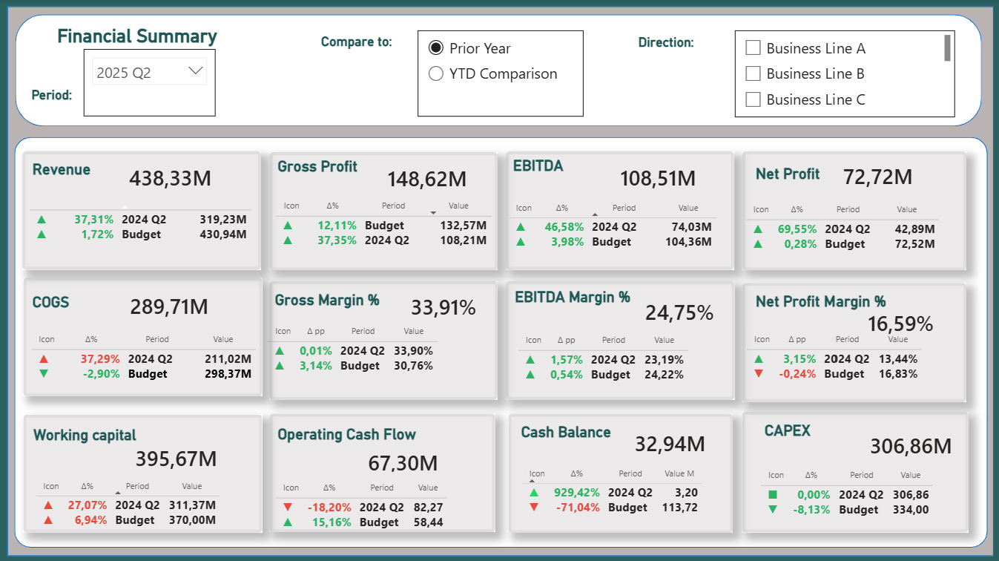
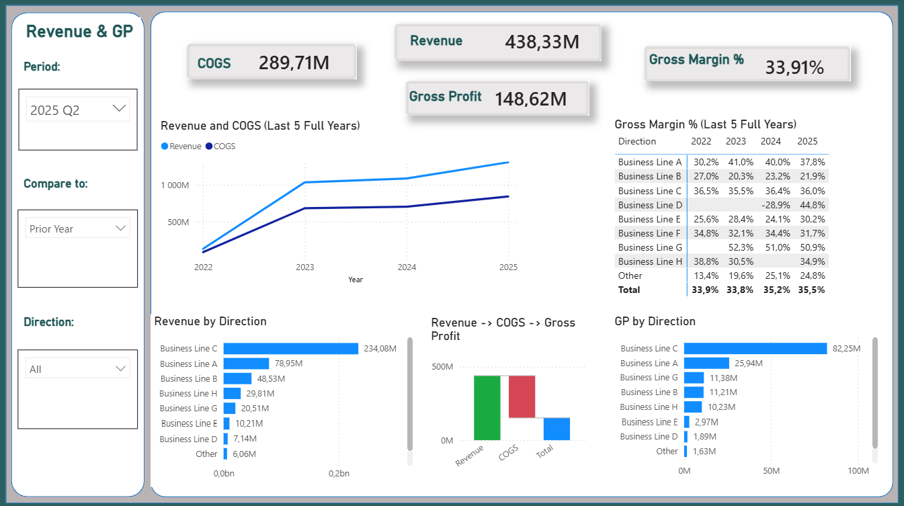
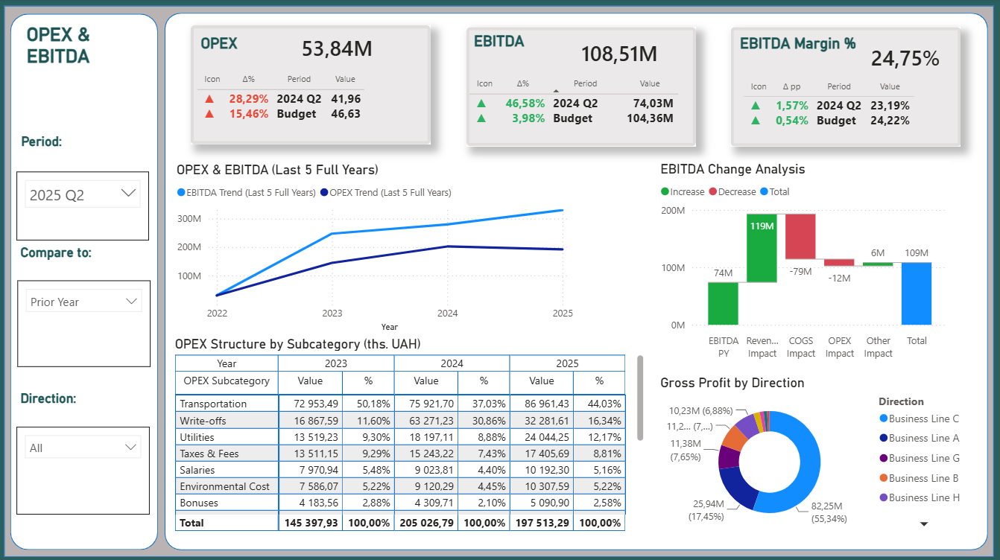
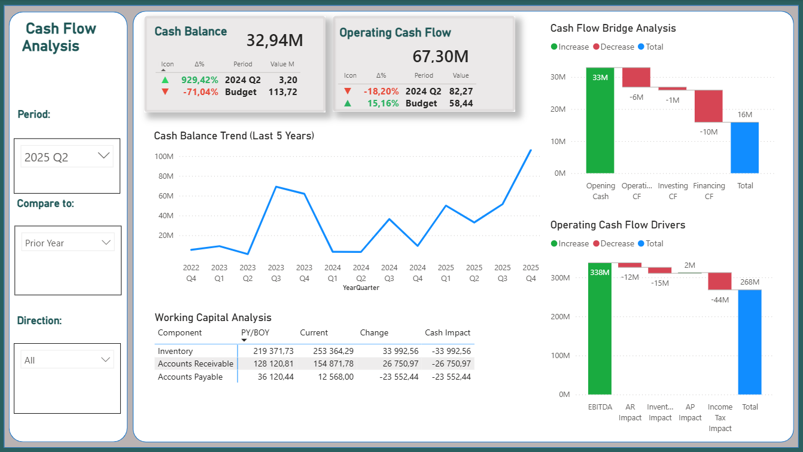
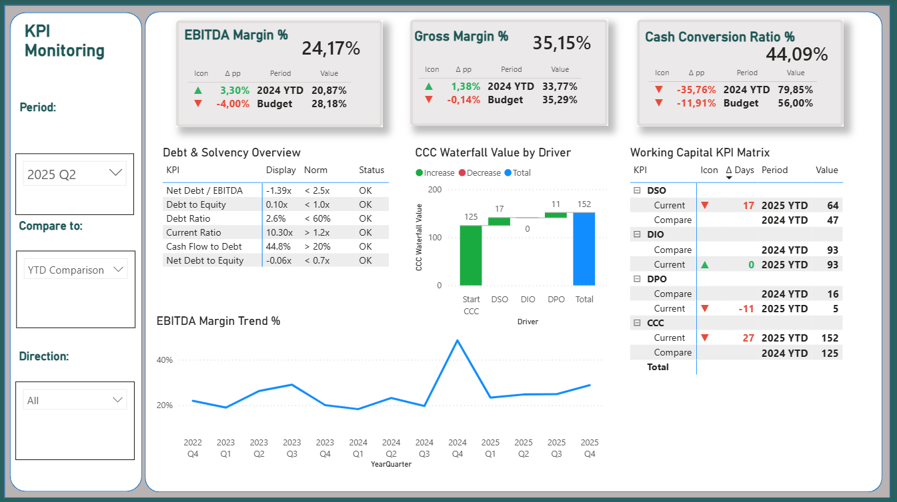

# Executive Financial Dashboard

## Overview

Executive Financial Dashboard developed in Power BI for manufacturing business analytics.

The dashboard includes:

* Financial Summary
* Revenue & Gross Profit
* OPEX & EBITDA
* Cash Flow Analysis
* Executive KPI Dashboard

## Technologies Used

* Power BI
* DAX
* Power Query
* SQL Server
* Excel

## Key Features

* Dynamic KPI cards
* Variance Analysis
* Prior Year vs YTD Comparison
* Executive Dashboard Design
* Financial Trend Analysis

## Author

Serhii Khomenko

## Financial Summary

Serves as the executive overview of the company's financial performance by consolidating the most important financial and operational KPIs into a single dashboard. The page provides management with an instant view of profitability, liquidity, cash generation, investment activity, and working capital performance while enabling interactive analysis by reporting period, comparison scenario, and business line.

### Interactive Filters

* **Period** – Selects the reporting period for analysis.
* **Compare To** – Compares current results against Prior Year or YTD.
* **Direction** – Filters all visualizations by business line.

### KPI Cards

* **Revenue** – Total revenue generated during the selected period.
* **COGS** – Total Cost of Goods Sold.
* **Gross Profit** – Revenue minus COGS.
* **Gross Margin %** – Gross profit as a percentage of revenue.
* **EBITDA** – Operating profit before interest, taxes, depreciation, and amortization.
* **EBITDA Margin %** – EBITDA expressed as a percentage of revenue.
* **Net Profit** – Profit after all operating and non-operating expenses.
* **Net Profit Margin %** – Net profit as a percentage of revenue.
* **Working Capital** – Net investment in operating current assets.
* **Operating Cash Flow** – Cash generated from operating activities.
* **Cash Balance** – Ending cash balance available at the end of the reporting period.
* **CAPEX** – Capital expenditures invested during the selected period.

### KPI Comparison Panel

Each KPI card includes a comparison against **Prior Period** or **Budget**, displaying:

* Performance variance (%)
* Trend indicators (increase/decrease)
* Comparison period
* Reference value

This enables users to quickly evaluate performance against historical results or business targets.

### Business Value

Provides executives with a single source of truth for monitoring financial performance and business health. The dashboard enables rapid identification of performance deviations, supports strategic and operational decision-making, and serves as the starting point for deeper analysis in the Revenue & Gross Profit, OPEX & EBITDA, Cash Flow Analysis, and KPI Monitoring pages.

## Revenue & Gross Profit

 
Analyzes revenue growth and gross profitability across the business. This page helps users evaluate sales performance, cost efficiency, and profitability trends across different business lines.

### Visualizations

* **Revenue KPI** – Displays total revenue for the selected reporting period.

* **COGS KPI** – Shows the total Cost of Goods Sold.

* **Gross Profit KPI** – Displays gross profit calculated as Revenue minus COGS.

* **Gross Margin % KPI** – Shows gross profitability as a percentage of revenue.

* **Revenue and COGS (Last 5 Years)** – Compares revenue and COGS trends over the last five full years to evaluate long-term business growth and cost dynamics.

* **Gross Margin % (Last 5 Years)** – Displays gross margin by business line across multiple years, enabling comparison of profitability trends.

* **Revenue by Direction** – Ranks business lines based on their contribution to total revenue.

* **Revenue → COGS → Gross Profit** – Waterfall chart illustrating how revenue is transformed into gross profit after deducting the cost of goods sold.

* **Gross Profit by Direction** – Compares gross profit generated by each business line to identify the most profitable business segments.

### Business Value

Enables management to monitor revenue growth, evaluate gross profitability, compare business line performance, and identify the key drivers of financial results. The dashboard supports strategic decision-making related to pricing, product mix, and operational efficiency.

## OPEX & EBITDA

Analyzes operating expenses and EBITDA performance to help evaluate cost efficiency, operational profitability, and the key drivers influencing earnings. The page supports comparison across reporting periods and business lines.

### Visualizations

* **OPEX KPI** – Displays total operating expenses for the selected reporting period.

* **EBITDA KPI** – Shows EBITDA, representing operating profitability before interest, taxes, depreciation, and amortization.

* **EBITDA Margin % KPI** – Displays EBITDA as a percentage of revenue, measuring operational profitability.

* **OPEX & EBITDA (Last 5 Years)** – Compares long-term trends of operating expenses and EBITDA to evaluate cost control and profitability over time.

* **EBITDA Change Analysis** – Waterfall chart illustrating the factors driving the change in EBITDA, including revenue growth, COGS, OPEX, and other operational impacts.

* **OPEX Structure by Subcategory** – Breaks down operating expenses by subcategory, allowing users to analyze cost composition and identify major expense drivers.

* **EBITDA by Direction** – Shows the contribution of each business line to total EBITDA, highlighting the most profitable business segments.

### Business Value

Provides management with a comprehensive view of operating cost efficiency and profitability. The dashboard helps identify expense optimization opportunities, evaluate EBITDA drivers, monitor profitability trends, and support operational and strategic decision-making.

## Cash Flow Analysis

Provides a comprehensive analysis of the company's cash flow position by monitoring cash balance, operating cash flow, and the key factors influencing cash generation. The dashboard helps users evaluate liquidity, understand cash flow drivers, and support financial planning.

### Visualizations

* **Cash Balance KPI** – Displays the ending cash balance for the selected reporting period.

* **Operating Cash Flow KPI** – Shows cash generated from operating activities.

* **Cash Balance Trend (Last 5 Years)** – Visualizes the historical cash balance trend over the last five years, helping identify long-term liquidity patterns.

* **Working Capital Analysis** – Displays changes in Inventory, Accounts Receivable, and Accounts Payable together with their impact on operating cash flow.

* **Cash Flow Bridge Analysis** – Waterfall chart illustrating how Opening Cash, Operating Cash Flow, Investing Cash Flow, and Financing Cash Flow contribute to the Ending Cash Balance.

* **Operating Cash Flow Drivers** – Waterfall chart explaining how EBITDA, changes in Working Capital components, and Income Tax affect Operating Cash Flow.

### Business Value

Helps management monitor liquidity, understand the key drivers of cash generation, evaluate the impact of working capital on cash flow, and support investment, financing, and operational decision-making.

## Executive KPI Dashboard

Provides a consolidated view of key financial performance indicators, profitability metrics, liquidity ratios, solvency measures, and working capital efficiency. The page enables management to monitor overall business health and quickly identify areas requiring attention.

### Visualizations

* **EBITDA Margin % KPI** – Displays EBITDA as a percentage of revenue, measuring operating profitability.

* **Gross Margin % KPI** – Shows gross profitability as a percentage of revenue.

* **Cash Conversion Ratio % KPI** – Measures the company's ability to convert operating cash flow into revenue.

* **Debt & Solvency Overview** – Monitors key liquidity and solvency ratios, including Net Debt / EBITDA, Debt to Equity, Debt Ratio, Current Ratio, Cash Flow to Debt, and Net Debt to Equity. Status indicators provide a quick assessment against predefined benchmarks.

* **CCC Waterfall Value by Driver** – Waterfall chart illustrating how Days Sales Outstanding (DSO), Days Inventory Outstanding (DIO), and Days Payables Outstanding (DPO) contribute to changes in the Cash Conversion Cycle (CCC).

* **Working Capital KPI Matrix** – Displays the current values and period-over-period changes for DSO, DIO, DPO, and CCC, helping monitor working capital efficiency.

* **EBITDA Margin Trend %** – Shows the historical trend of EBITDA Margin, enabling users to monitor long-term profitability performance.

### Business Value

Supports executive decision-making by providing a comprehensive overview of financial health, operational efficiency, liquidity, leverage, and working capital performance. The dashboard enables early identification of financial risks, tracks KPI trends against targets, and helps management focus on the key drivers of sustainable business performance.

